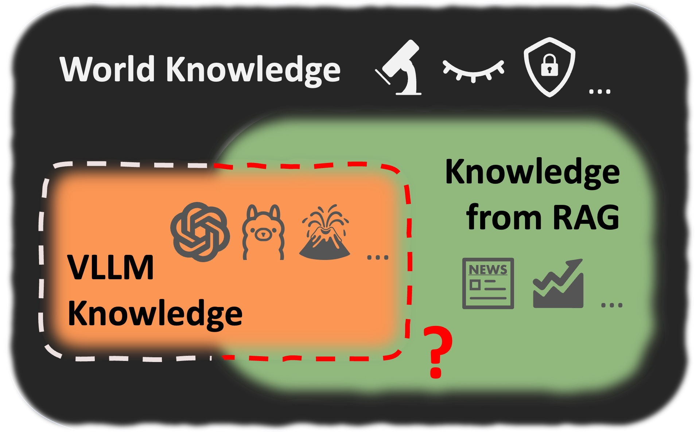

# VLLM-KnowledgeBoundary
Source code of paper "[Detecting Knowledge Boundary of Vision Large Language Models by Sampling-Based Inference](https://arxiv.org/abs/2502.18023)"




## Environment
```bash
# python=3.11
pip install -r requirements.txt
```
We recommand using `cuda=12.1` to prevent potential issues of version conflicts, and our experiments are conducted on `NVIDIA A100-SXM4-80GB`.

## Download 
[Training data]() to training/training_data

[Evaluation data]() to evaluation/eval_data


## To train the Knowledge Boundary Model
Refer to `training/scripts`

## To evaluate the trained Knowledge Boundary Model
Refer to `src/eval_KB_model.py` (Qwen) and `src/eval_ds_KB_model.py` (DeepSeek)

## To show the evaluated scores
Refer to `evaluation/scripts`